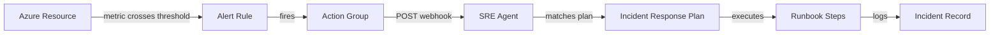
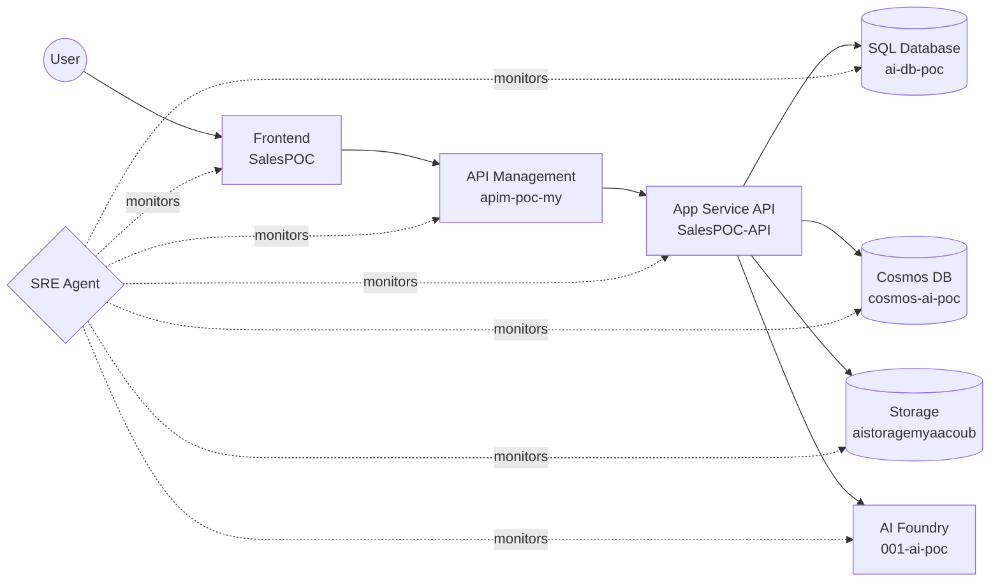
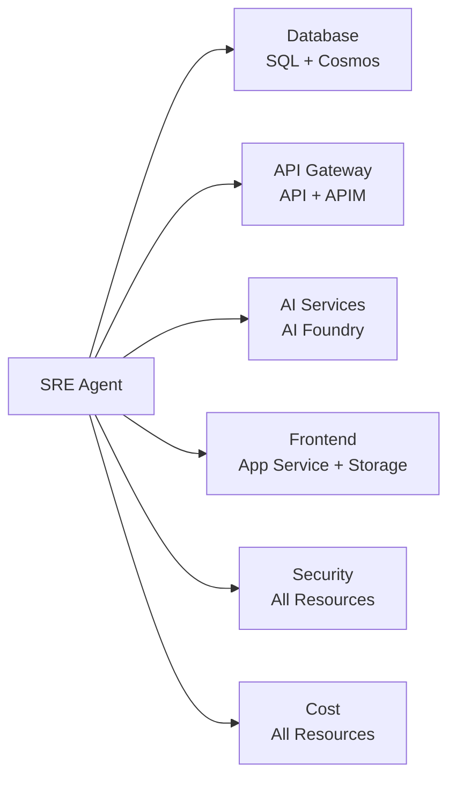

# SRE Agent: sre-ai-my

An Azure SRE Agent that automatically monitors, diagnoses, and remediates issues across the Sales POC infrastructure. It watches 7 Azure resources and 7 GitHub repos around the clock — no human on-call needed for common incidents.

## What Does It Do?

**The agent acts as an always-on SRE team member.** It continuously monitors your Azure infrastructure and responds to problems the same way a human SRE would — but in seconds, not minutes.

### Example: API Goes Down at 3 AM

Here's what happens when the backend API starts returning 500 errors:

```
1. Azure Monitor detects Http5xx > 20 in 5 minutes on SalesPOC-API
2. Alert rule "sre-api-5xx-spike" fires → Action Group sends webhook to SRE Agent
3. Agent matches the alert to incident plan "api_5xx_spike" (SEV1)
4. Agent executes the runbook automatically:
   - Checks App Insights for the root cause exception
   - Verifies SQL DB, Cosmos DB, and Storage connectivity
   - Restarts the App Service: az webapp restart --name SalesPOC-API
   - Scales out if load is too high: az appservice plan update --number-of-workers 3
5. Incident is logged with full diagnosis and actions taken
```

No pager. No 3 AM wake-up. The agent handles it.

### Example: Database Running Out of Space

```
1. Azure Monitor detects storage_percent > 90% on SQL Database ai-db-poc
2. Alert "sre-sql-storage-critical" fires (SEV2)
3. Agent runs the "sql_storage_critical" plan:
   - Queries sys.dm_db_partition_stats for largest tables
   - Identifies candidates for archival
   - Recommends or executes: az sql db update --max-size 250GB
```

### Example: Cosmos DB Throttling Under Load

```
1. Normalized RU% > 90% on cosmos-ai-poc
2. Alert "sre-cosmos-throttling" fires (SEV2)
3. Agent auto-remediates:
   - Checks partition-level RU usage to find hot partitions
   - Scales throughput: az cosmosdb sql container throughput update --throughput 1000
   - Flags cross-partition queries for developer review
```

### Example: Security — Unauthorized API Request Spike

```
1. APIM logs > 100 unauthorized requests in 5 minutes
2. Alert "sre-apim-auth-spike" fires (SEV2)
3. Agent investigates:
   - Analyzes source IPs for patterns (possible credential stuffing)
   - Checks if subscription keys were revoked/expired
   - Recommends IP blocking via APIM policy
   - Alerts team to rotate credentials if compromise suspected
```

---

## How It Works



The agent has three modes of operation:

| Mode | How It Works | Example |
|---|---|---|
| **Reactive** | Azure Monitor alert fires → webhook → agent runs matching incident plan | API 5xx spike → restart + scale |
| **Proactive** | Scheduled tasks run on cron intervals, checking for issues before they alert | Health check every 5 min catches degradation early |
| **On-Demand** | Query the agent directly via its REST API or the Azure portal | "What's the current health of all resources?" |

---

## Monitored Resources

The agent watches these 7 Azure resources that make up the Sales POC application:



| Resource | Azure Name | What the Agent Watches |
|---|---|---|
| **SQL Database** | `ai-db-poc` | CPU, storage, connections, deadlocks |
| **Cosmos DB** | `cosmos-ai-poc` | RU consumption, throttling (429s), replication lag |
| **Storage** | `aistoragemyaacoub` | Availability, latency |
| **API** | `SalesPOC-API` | 5xx errors, response time, CPU/memory |
| **APIM** | `apim-poc-my` | Capacity, backend duration, unauthorized requests |
| **AI Foundry** | `001-ai-poc` | Error rate, inference latency |
| **Frontend** | `SalesPOC` | HTTP errors, response time |

It also monitors **7 GitHub repos** for failing CI/CD, open PRs, and dependency alerts:
`SalesPOC.UI` · `SalesPOC.API` · `SalesPOC.MCP` · `SalesPOC.APIM` · `SalesPOC.APIC` · `SalesPOC.DB` · `SalesPOC.AI`

---

## Incident Response Plans (17 Plans)

Every alert maps to a plan with a runbook the agent follows. Plans marked "Auto" will remediate without human approval.

| Plan | Trigger | Sev | Auto | What the Agent Does |
|---|---|---|---|---|
| **SQL High CPU** | CPU > 90% | 2 | Yes | Finds top CPU queries, kills long-running txns, scales vCores |
| **SQL Connection Failures** | Failed > 20/5min | 1 | — | Checks firewall, server status, connection pools, restarts API |
| **SQL Deadlocks** | Deadlocks > 5/5min | 2 | — | Captures deadlock graph, identifies conflicts, recommends indexes |
| **SQL Storage Critical** | Storage > 90% | 2 | — | Finds large tables, recommends archival, can scale max size |
| **Cosmos DB Throttling** | 429s > 50/5min | 2 | Yes | Checks partitions, scales RUs, flags bad queries |
| **Cosmos DB Replication Lag** | Lag > 500ms | 2 | — | Checks regions, consistency level, write volume |
| **Storage Availability Drop** | < 99% | 1 | — | Checks Azure status, storage diagnostics, initiates failover |
| **Storage High Latency** | E2E > 500ms | 3 | — | Checks throttling, request patterns, recommends CDN |
| **API 5xx Spike** | 5xx > 20/5min | 1 | Yes | Checks App Insights, dependencies, restarts, scales out |
| **API High Response Time** | > 3s | 2 | — | Profiles endpoints, checks downstream, scales |
| **API Resource Exhaustion** | CPU/Mem > 90% | 2 | Yes | Identifies bottleneck, scales out workers |
| **APIM Capacity High** | > 90% | 2 | — | Checks traffic, scales units, applies rate limiting |
| **APIM Backend Slow** | Backend > 5s | 2 | — | Identifies slow backend, checks circuit breaker, adds caching |
| **APIM Auth Spike** | 401s > 100/5min | 2 | — | Analyzes IPs, checks keys, blocks suspicious traffic |
| **AI Foundry Errors** | Errors > 20/5min | 2 | — | Checks deployment, categorizes errors, verifies quota |
| **AI Foundry Latency** | > 5000ms | 3 | — | Checks prompt sizes, regional load, reduces max tokens |
| **Frontend HTTP Errors** | 5xx > 20/5min | 2 | — | Checks logs, verifies API, restarts, checks recent deploys |

---

## Scheduled Tasks

The agent doesn't just wait for alerts — it actively looks for problems on a schedule:

| Task | Runs Every | What It Does |
|---|---|---|
| **Health Check All Resources** | 5 min | Checks CPU, memory, availability, error rates, connections across all 7 resources |
| **Subagent Analysis** | 15 min | Runs 6 specialized subagents (Database, API, AI, Frontend, Security, Cost) |
| **Security Scan** | 15 min | Scans for unauthorized access spikes, misconfigured RBAC, exposed secrets, firewall issues |
| **GitHub Repo Check** | 1 hour | Checks for failing CI/CD, PRs awaiting review, high-priority issues, dependency alerts |
| **Cost Analysis** | 6 hours | Reviews spending vs budget, idle resources, right-sizing opportunities |
| **Daily SRE Report** | 8 AM UTC | 24-hour summary: health, incidents, metrics, alerts, GitHub activity, cost trends |

### Subagents

Six specialized subagents each focus on a domain:



---

## Getting Started

### Prerequisites

- Azure subscription with the `ai-myaacoub` resource group
- `az` CLI authenticated
- **SRE Agent Reader** role (or higher) on the `sre-ai-my` agent resource
- The managed identity `sre-ai-my-identity` needs **Monitoring Reader** on the resource group

### 1. Deploy (Automated via CI/CD)

Push to `main` → GitHub Actions deploys everything automatically in 3 jobs:

```
build          → Lint, build Docker image, push to GHCR
deploy-agent   → Deploy Bicep (Container App + identity + RBAC)
                 Provision connectors (AzureMonitor, ResourceGraph, GitHub)
                 Configure managed resources + feature flags
deploy-monitoring → Deploy 18 alert rules + action group webhook
```

Required GitHub repository secrets:

| Secret | Description |
|---|---|
| `AZURE_CLIENT_ID` | Service principal client ID (OIDC federated credential) |
| `AZURE_TENANT_ID` | Azure AD tenant ID |
| `APP_INSIGHTS_CONNECTION_STRING` | Application Insights connection string |

### 2. Provision Agent API Resources (Manual — One Time)

Scheduled tasks, incident response plans, and GitHub repos require the agent's own REST API, which only accepts user-delegated tokens (not service principals):

```bash
az login
bash infra/provision-agent-api.sh https://sre-ai-my--0cad75dc.4650bed8.eastus2.azuresre.ai
```

The script is idempotent — safe to re-run anytime. It creates:
- 6 scheduled tasks
- 17 incident response plan filters + handlers
- 7 GitHub repository connections

### 3. Connect GitHub (One Time)

The agent needs a GitHub PAT to access repositories:

```bash
TOKEN=$(az account get-access-token --resource "https://azuresre.ai" --query "accessToken" -o tsv)

curl -X POST "https://sre-ai-my--0cad75dc.4650bed8.eastus2.azuresre.ai/api/v1/github/auth/pat" \
  -H "Authorization: Bearer $TOKEN" \
  -H "Content-Type: application/x-www-form-urlencoded" \
  -d "pat=ghp_YOUR_GITHUB_PAT_HERE"
```

The PAT needs `repo` scope for the `csdmichael` org repositories.

### Local Development

```bash
python -m venv .venv
.venv\Scripts\activate          # Windows
pip install -r requirements.txt
cp .env.example .env            # Edit with your values
python -m src.main
```

---

## Agent REST API

The agent exposes its own REST API at `https://sre-ai-my--0cad75dc.4650bed8.eastus2.azuresre.ai`. All requests need a Bearer token:

```bash
TOKEN=$(az account get-access-token --resource "https://azuresre.ai" --query "accessToken" -o tsv)
```

### Examples

**List all scheduled tasks:**
```bash
curl -H "Authorization: Bearer $TOKEN" \
  "https://sre-ai-my--0cad75dc.4650bed8.eastus2.azuresre.ai/api/v1/scheduledtasks"
```

**Trigger a health check manually:**
```bash
curl -X POST -H "Authorization: Bearer $TOKEN" \
  "https://sre-ai-my--0cad75dc.4650bed8.eastus2.azuresre.ai/api/v1/scheduledtasks/{task-id}/execute"
```

**List active incident response plans:**
```bash
curl -H "Authorization: Bearer $TOKEN" \
  "https://sre-ai-my--0cad75dc.4650bed8.eastus2.azuresre.ai/api/v1/incidentplayground/handlers"
```

**Check agent health:**
```bash
curl "https://sre-ai-my--0cad75dc.4650bed8.eastus2.azuresre.ai/api/health"
```

### Full API Reference

| Method | Path | Description |
|---|---|---|
| `GET/POST` | `/api/v1/scheduledtasks` | List / create scheduled tasks |
| `PUT/DELETE` | `/api/v1/scheduledtasks/{id}` | Update / delete a task |
| `POST` | `/api/v1/scheduledtasks/{id}/pause\|resume\|execute` | Task lifecycle |
| `GET` | `/api/v1/incidentplayground/handlers` | List incident response plans |
| `PUT` | `/api/v1/incidentplayground/handlers/{id}` | Create incident response plan |
| `GET` | `/api/v1/incidentplayground/filters` | List incident filters |
| `PUT` | `/api/v1/incidentplayground/filters/{id}` | Create incident filter |
| `GET` | `/api/v1/httptriggers` | List HTTP triggers |
| `GET/PUT` | `/api/v2/repos/{name}` | List / register GitHub repos |
| `GET` | `/api/v1/github/config` | GitHub OAuth configuration |
| `POST` | `/api/v1/github/auth/pat` | Set GitHub PAT |
| `GET` | `/api/v1/feature/details` | Agent feature flags |
| `POST` | `/api/alerts/webhook` | Azure Monitor webhook receiver |
| `GET` | `/api/health` | Full health check |
| `GET` | `/healthz` | Lightweight liveness probe |

---

## Architecture

```mermaid
graph TB
    subgraph SRE["SRE Agent (sre-ai-my)"]
        Agent[SRE Agent Core]
        WH[Webhook Server :8080]
        LZ[/healthz liveness probe/]
        Sched[Task Scheduler]
        IM[Incident Manager]

        subgraph Subagents
            DB_SA[Database Subagent]
            API_SA[API Gateway Subagent]
            AI_SA[AI Services Subagent]
            FE_SA[Frontend Subagent]
            SEC_SA[Security Subagent]
            COST_SA[Cost Subagent]
        end

        KB[Knowledge Base]
        GH[GitHub Connector]
        MON[Azure Monitor Client]
    end

    subgraph AzMon["Azure Monitor"]
        AG[Action Group<br/>sre-ai-my-ag]
        AR[18 Metric Alert Rules]
    end

    subgraph Azure["Monitored Azure Resources"]
        SQL[(SQL Database)]
        COSMOS[(Cosmos DB)]
        STORAGE[(Storage Account)]
        API[App Service API]
        APIM[API Management]
        FOUNDRY[AI Foundry]
        FE[Frontend App Service]
    end

    subgraph GitHub["GitHub Repos"]
        UI_R[SalesPOC.UI]
        API_R[SalesPOC.API]
        MCP_R[SalesPOC.MCP]
        APIM_R[SalesPOC.APIM]
        APIC_R[SalesPOC.APIC]
        DB_R[SalesPOC.DB]
        AI_R[SalesPOC.AI]
    end

    Agent --> Sched
    Agent --> IM
    Agent --> MON
    Agent --> GH

    AR -.evaluates.-> SQL
    AR -.evaluates.-> COSMOS
    AR -.evaluates.-> STORAGE
    AR -.evaluates.-> API
    AR -.evaluates.-> APIM
    AR -.evaluates.-> FOUNDRY
    AR -.evaluates.-> FE
    AR --fires--> AG
    AG --webhook POST--> WH
    WH --> IM

    DB_SA --> SQL
    DB_SA --> COSMOS
    API_SA --> API
    API_SA --> APIM
    AI_SA --> FOUNDRY
    FE_SA --> FE
    FE_SA --> STORAGE

    MON --> SQL
    MON --> COSMOS
    MON --> STORAGE
    MON --> API
    MON --> APIM
    MON --> FOUNDRY
    MON --> FE

    GH --> UI_R
    GH --> API_R
    GH --> MCP_R
    GH --> APIM_R
    GH --> APIC_R
    GH --> DB_R
    GH --> AI_R
```



### Data Connectors

| Connector | Type | Purpose |
|---|---|---|
| `azuremonitor` | AzureMonitor | Metric & alert data |
| `azureresourcegraph` | AzureResourceGraph | Resource discovery & topology |
| `github` | GitHub | Code-aware incident response |

### SLA Targets

| Resource | Availability | Latency Target |
|---|---|---|
| SQL Database | 99.99% | 100ms |
| Cosmos DB | 99.999% | 10ms |
| Storage | 99.9% | 60ms |
| API | 99.95% | 500ms |
| APIM | 99.95% | 1000ms |
| AI Foundry | 99.9% | 3000ms |
| Frontend | 99.95% | 200ms |

---

## Project Structure

```
├── .github/workflows/deploy.yml   # CI/CD pipeline (build → deploy-agent → deploy-monitoring)
├── infra/
│   ├── main.bicep                 # Container App, Log Analytics, Identity, RBAC
│   ├── main.bicepparam            # Bicep parameters
│   ├── alerts.bicep               # 18 Azure Monitor alert rules + action group
│   └── provision-agent-api.sh     # Provisions tasks, incident plans & repos (manual, one-time)
├── src/
│   ├── agent.py                   # SRE agent core + webhook processing
│   ├── config.py                  # All resource names, managed resources, settings
│   ├── github_connector.py        # GitHub repo monitoring
│   ├── incidents.py               # Incident plans + manager
│   ├── knowledge_base.py          # Architecture, troubleshooting, procedures
│   ├── main.py                    # Entry point
│   ├── metrics.py                 # Metric definitions + SLA targets
│   ├── monitors.py                # Azure Monitor queries (async via thread pool)
│   ├── scheduler.py               # Async scheduled task runner
│   ├── server.py                  # aiohttp webhook + health endpoints
│   └── subagents.py               # 6 specialized analysis subagents
├── Dockerfile
├── requirements.txt
└── .env.example
```

---

## Reference

### Resource Details

| Property | Value |
|---|---|
| **Name** | `sre-ai-my` |
| **Subscription** | `86b37969-9445-49cf-b03f-d8866235171c` |
| **Resource Group** | `ai-myaacoub` |
| **Region** | East US 2 |
| **Agent Endpoint** | `https://sre-ai-my--0cad75dc.4650bed8.eastus2.azuresre.ai` |
| **Managed Identity** | `sre-ai-my-identity` |
| **ARM Resource Type** | `Microsoft.App/agents` (API version `2025-05-01-preview`) |

### Alert Rules (18 total)

All rules evaluate every 5 minutes with a 5-minute window. Action group `sre-ai-my-ag` sends webhooks to the agent.

| Alert Rule | Resource | Metric | Condition | Sev |
|---|---|---|---|---|
| `sre-sql-high-cpu` | SQL DB | CPU % | > 90% | 2 |
| `sre-sql-connection-failures` | SQL DB | Failed connections | > 20 | 1 |
| `sre-sql-deadlocks` | SQL DB | Deadlocks | > 5 | 2 |
| `sre-sql-storage-critical` | SQL DB | Storage % | > 90% | 2 |
| `sre-cosmos-throttling` | Cosmos DB | Normalized RU % | > 90% | 2 |
| `sre-cosmos-replication-lag` | Cosmos DB | Replication latency | > 500ms | 2 |
| `sre-storage-availability-drop` | Storage | Availability | < 99% | 1 |
| `sre-storage-high-latency` | Storage | E2E Latency | > 500ms | 3 |
| `sre-api-5xx-spike` | API | Http5xx | > 5 (1min window, 1min eval) | 1 |
| `sre-api-high-response-time` | API | Response time | > 3s | 2 |
| `sre-api-cpu-exhaustion` | App Plan | CPU % | > 90% | 2 |
| `sre-api-memory-exhaustion` | App Plan | Memory % | > 90% | 2 |
| `sre-apim-capacity-high` | APIM | Capacity | > 90% | 2 |
| `sre-apim-backend-slow` | APIM | Backend duration | > 5000ms | 2 |
| `sre-apim-auth-spike` | APIM | Unauthorized | > 100 | 2 |
| `sre-foundry-high-error-rate` | AI Foundry | Total errors | > 20 | 2 |
| `sre-foundry-high-latency` | AI Foundry | Latency | > 5000ms | 3 |
| `sre-frontend-http-errors` | Frontend | Http5xx | > 20 | 2 |

### Metric Thresholds

<details>
<summary>SQL Database</summary>

| Metric | Warning | Critical |
|---|---|---|
| CPU Usage | 70% | 90% |
| Storage Usage | 75% | 90% |
| Failed Connections | 5 | 20 |
| Deadlocks | 1 | 5 |
| Active Workers | 70% | 90% |
</details>

<details>
<summary>Cosmos DB</summary>

| Metric | Warning | Critical |
|---|---|---|
| RU Consumption | 800 RU/s | 950 RU/s |
| Throttled Requests (429) | 10 | 50 |
| Replication Latency | 100ms | 500ms |
| Normalized RU % | 70% | 90% |
</details>

<details>
<summary>Storage Account</summary>

| Metric | Warning | Critical |
|---|---|---|
| Availability | < 99.5% | < 99.0% |
| E2E Latency | 100ms | 500ms |
| Server Latency | 50ms | 200ms |
</details>

<details>
<summary>API (App Service)</summary>

| Metric | Warning | Critical |
|---|---|---|
| Response Time | 1.0s | 3.0s |
| Server Errors (5xx) | 5 | 20 |
| Client Errors (4xx) | 50 | 200 |
</details>

<details>
<summary>API Management</summary>

| Metric | Warning | Critical |
|---|---|---|
| Failed Requests | 10 | 50 |
| Backend Duration | 1000ms | 5000ms |
| Gateway Capacity | 70% | 90% |
| Unauthorized (401) | 20 | 100 |
</details>

<details>
<summary>AI Foundry</summary>

| Metric | Warning | Critical |
|---|---|---|
| Total Errors | 5 | 20 |
| Latency | 2000ms | 5000ms |
| Success Rate | < 95% | < 90% |
</details>

<details>
<summary>Frontend (App Service)</summary>

| Metric | Warning | Critical |
|---|---|---|
| Response Time | 1.0s | 3.0s |
| Server Errors (5xx) | 5 | 20 |
</details>

### IAM Roles

| Role | Scope | Who | Purpose |
|---|---|---|---|
| **SRE Agent Reader** (or higher) | `sre-ai-my` agent | Users | Access the SRE agent portal |
| **Monitoring Reader** | `ai-myaacoub` RG | `sre-ai-my-identity` MI | Query Azure Monitor metrics |
| **Contributor** | `ai-myaacoub` RG | GitHub Actions SP | Deploy infrastructure |
