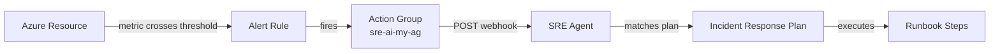
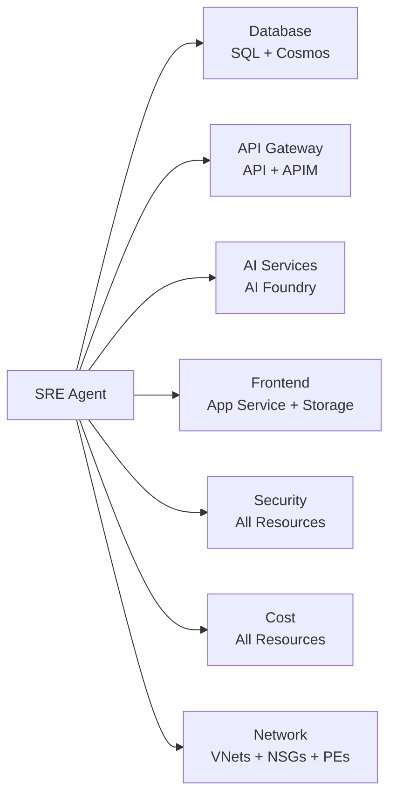

# SRE Agent Demo: sre-ai-my

A step-by-step demo walkthrough for the Azure SRE Agent that monitors, diagnoses, and remediates issues across the Sales POC infrastructure.

**Agent endpoint:** `https://sre-ai-my--0cad75dc.4650bed8.eastus2.azuresre.ai`
**Monitored application:** [https://salespoc.azurewebsites.net](https://salespoc.azurewebsites.net)

---

## Prerequisites

- Azure subscription with resource group `ai-myaacoub`
- `az` CLI authenticated
- Access to the SRE Agent portal at [portal.azure.com](https://portal.azure.com)

---

## Part 1 — Connectors

Navigate to the **Connectors** tab in the SRE Agent portal. Three connectors provide data access:

| Connector | Type | Purpose |
|---|---|---|
| **azuremonitor** | Azure Monitor | Metrics, logs, and alert integration |
| **azureresourcegraph** | Azure Resource Graph | Cross-resource querying |
| **github** | GitHub | Repository status, CI/CD, PRs, issues |

**Demo points:**
- Show each connector's status (should be `Succeeded`)
- Explain that the managed identity is used for Azure connectors
- GitHub uses a PAT for repository access

**GitHub repositories:**

| Repository | URL |
|---|---|
| SalesPOC.UI | https://github.com/csdmichael/SalesPOC.UI |
| SalesPOC.API | https://github.com/csdmichael/SalesPOC.API |
| SalesPOC.MCP | https://github.com/csdmichael/SalesPOC.MCP |
| SalesPOC.APIM | https://github.com/csdmichael/SalesPOC.APIM |
| SalesPOC.DB | https://github.com/csdmichael/SalesPOC.DB |
| SalesPOC.AI | https://github.com/csdmichael/SalesPOC.AI |
| SalesPOC.Containerized.API | https://github.com/csdmichael/SalesPOC.Containerized.API |

---

## Part 2 — Settings

Review the agent's configuration in the **Settings** tab:

| Setting | Value | Notes |
|---|---|---|
| **Access Level** | High | Agent can take remediation actions |
| **Mode** | Review | Actions are proposed, then executed |
| **Model** | Automatic (Anthropic) | AI model selection |
| **Monthly Unit Limit** | 50,000 | Budget guardrail |
| **Upgrade Channel** | Stable | |
| **Managed Resources** | 16 Azure resources + subscription + RG | Full resource list below |

**Managed resources:**

| Resource | Azure Name |
|---|---|
| SQL Database | `ai-db-poc` |
| Cosmos DB | `cosmos-ai-poc` |
| Storage Account | `aistoragemyaacoub` |
| App Service (API) | `SalesPOC-API` |
| API Management | `apim-poc-my` |
| AI Foundry | `001-ai-poc` |
| App Service (Frontend) | `SalesPOC` |
| App Service Plan | `ASP-aimyaacoub-87dc` |
| VNet | `mymsx-vnet` |
| VNet | `vnet-salespoc-westus2` |
| NSG | `mymsx-vnet-app-subnet-nsg-westus2` |
| NSG | `vnet-salespoc-westus2-snet-appservice-nsg-westus2` |
| NSG | `vnet-salespoc-westus2-snet-private-endpoints-nsg-westus2` |
| Private Endpoint | `pe-blob-westus2` |
| Private Endpoint | `pe-cosmos-westus2` |
| Private Endpoint | `pe-sql-westus2` |

---

## Part 3 — Agent Chat

Open the SRE Agent in the Azure portal and use the **Chat** pane to interact with it directly.

**Try these prompts:**

| Prompt | What it demonstrates |
|---|---|
| *"What are API Response times for all apis last 7 days on ai-myaacoub resource group?"* | Queries Azure Monitor metrics across multiple resources over a time range |
| *"Plot a pie chart for apps hosted on app services vs container apps vs AKS"* | Uses Resource Graph to inventory compute resources and renders a chart |
| *"List azure resources sorted by highest price for last 30 days in resource group ai-myaacoub. Plot on bar chart"* | Pulls cost data and visualizes spending per resource |
| *"Does my API Management instance have any unhealthy backend apps?"* | Checks APIM backend health status in real time |
| *"What are the apis hosted on apim-poc-my?"* | Lists APIs registered in the APIM instance |
| *"What is the current health of SalesPOC-API?"* | Real-time health check of a single resource |
| *"Are there any active incidents?"* | Queries incident state |
| *"Check the latest deployments across our GitHub repos"* | Uses the GitHub connector to review CI/CD status |

The agent uses its managed identity (`sre-ai-my-identity`) with **Contributor** access to query and act on resources.

---

## Part 4 — Incident Response

This section covers the end-to-end incident response pipeline: how alerts fire, reach the agent, and trigger automated remediation.

### 4.1 Set Incident Platform to Azure Monitor

In the SRE Agent portal, go to **Incident Management** and confirm the configuration:

| Setting | Value |
|---|---|
| **Platform** | Azure Monitor |
| **Connection** | `azmonitor` |

This tells the agent to receive incidents from Azure Monitor alert webhooks.

### 4.2 Configure Azure Monitor Metrics & Alerts

The agent watches 15 resources via **23 metric alert rules + 2 activity-log alert rules** deployed through [infra/alerts.bicep](infra/alerts.bicep). Each rule evaluates a metric threshold (or activity-log event) and fires into the `sre-ai-my-ag` action group, which POSTs a webhook to the agent and sends an email notification to `myaacoub@microsoft.com`.



**Example alert rules to highlight:**

| Alert Rule | Resource | Condition | Severity |
|---|---|---|---|
| `sre-api-5xx-spike` | SalesPOC-API | Http5xx > 20 in 5 min | 1 |
| `sre-sql-cpu-high` | ai-db-poc | CPU > 90% | 2 |
| `sre-cosmos-throttling` | cosmos-ai-poc | 429 responses > 50 in 5 min | 2 |
| `sre-apim-auth-spike` | apim-poc-my | Unauthorized > 100 in 5 min | 2 |
| `sre-vnet0-ddos-attack` | mymsx-vnet | DDoS attack detected | 1 |
| `sre-nsg-rule-change` | All NSGs | NSG rule modified (activity log) | 2 |
| `sre-pe-blob-bytes-drop` | pe-blob-westus2 | PE data throughput dropped | 2 |

**Demo:** Open Azure Monitor → Alerts → show the alert rules and action group. Click into one rule to show the metric threshold, evaluation window, and webhook action.

### 4.3 Add HTTP Triggers in SRE Agent

Navigate to **HTTP Triggers** in the agent portal. The webhook endpoint is:

```
POST https://{containerAppFqdn}/api/alerts/webhook
```

The agent receives the Common Alert Schema payload, extracts the alert rule name, and routes it to the matching incident response plan via `webhookProperties.planName`.

**Demo:** Show the HTTP trigger configuration and explain how the `planName` property in the webhook payload maps alerts to plans.

### 4.4 Implement Incident Response Plans

Navigate to **Incident Playground → Handlers** and **Filters** in the agent portal. There are **24 incident response plans**, each with a filter that matches on the alert name.

**Key plans to demo:**

| Plan | Trigger | Sev | Auto-Remediate | What the Agent Does |
|---|---|---|---|---|
| **API 5xx Spike** | `sre-api-5xx-spike` | 1 | Yes | Checks App Insights → verifies dependencies → restarts App Service → scales out |
| **SQL High CPU** | `sre-sql-cpu-high` | 2 | Yes | Finds top CPU queries → kills long-running txns → scales vCores |
| **Cosmos Throttling** | `sre-cosmos-throttling` | 2 | Yes | Checks partitions → scales RUs → flags bad queries |
| **APIM Auth Spike** | `sre-apim-auth-spike` | 2 | No | Analyzes source IPs → checks keys → recommends blocking |

**Full plan list:**

| Plan | Sev | Auto |
|---|---|---|
| SQL High CPU | 2 | Yes |
| SQL Connection Failures | 1 | — |
| SQL Deadlocks | 2 | — |
| SQL Storage Critical | 2 | — |
| Cosmos DB Throttling | 2 | Yes |
| Cosmos DB Replication Lag | 2 | — |
| Storage Availability Drop | 1 | — |
| Storage High Latency | 3 | — |
| API 5xx Spike | 1 | Yes |
| API High Response Time | 2 | — |
| API Resource Exhaustion | 2 | Yes |
| APIM Capacity High | 2 | — |
| APIM Backend Slow | 2 | — |
| APIM Auth Spike | 2 | — |
| AI Foundry Errors | 2 | — |
| AI Foundry Latency | 3 | — |
| Frontend HTTP Errors | 2 | — |
| VNet DDoS Attack | 1 | — |
| VNet Config Change | 3 | — |
| NSG Denied Flows Spike | 2 | — |
| NSG Rule Change | 2 | — |
| PE Connection Failed | 1 | — |
| PE Data Drop | 2 | — |

**Demo walkthrough — API 5xx Spike scenario:**

```
1. Azure Monitor detects Http5xx > 5 in 1 min on SalesPOC-API
2. Alert "sre-api-5xx-spike" fires → Action Group POSTs webhook
3. Agent matches alert to plan "api_5xx_spike" (SEV1, auto-remediate)
4. Agent executes the runbook:
   - Checks App Insights for root cause exception
   - Verifies SQL DB, Cosmos DB, and Storage connectivity
   - Restarts the App Service: az webapp restart --name SalesPOC-API
   - Scales out: az appservice plan update --number-of-workers 3
5. Incident logged with full diagnosis and actions taken
```

---

## Part 5 — Infrastructure Reporting (RCA, Resource Health Reports)

This section covers how the agent proactively monitors infrastructure and produces reports — without waiting for alerts to fire.

### 5.1 Scheduled Tasks

Navigate to **Scheduled Tasks** in the agent portal. Seven tasks run on cron schedules:

| Task | Schedule | What It Does |
|---|---|---|
| **Health Check** | Every 5 min | Full health check of all monitored resources including SQL DB, Cosmos DB, Storage, API, APIM, AI Foundry, and Frontend. Checks CPU, memory, availability, error rates, and connection health. |
| **Network Health Check** | Every 5 min | Checks health of VNets (DDoS status), NSGs (rule integrity), and Private Endpoints (connection state and data throughput) across all network resources. |
| **Subagent Analysis** | Every 15 min | Runs 7 specialized subagents (Database, API, AI, Frontend, Security, Cost, Network) for deep-dive analysis |
| **Security Scan** | Every 15 min | Scans for unauthorized access spikes, misconfigured RBAC, exposed secrets, firewall issues |
| **GitHub Repo Check** | Every 1 hour | Checks CI/CD status, open PRs, high-priority issues, and dependency alerts across all repos |
| **Cost Analysis** | Every 6 hours | Reviews spending vs budget, identifies idle resources, right-sizing opportunities |
| **Daily SRE Report** | 8 AM UTC | 24-hour summary: health, incidents, metrics, alerts, GitHub activity, cost trends, network status |

**Demo:** Open a task → show the cron schedule, prompt, and last execution result. Trigger the **Health Check** manually to show real-time output.

**Subagents** — Seven specialized subagents used by the Subagent Analysis task:



### 5.2 Agent Canvas

Navigate to the **Canvas** tab in the agent portal. The canvas provides:

- **Resource health dashboard** — Live status of all 16 managed resources with key metrics
- **Incident timeline** — Visual history of incidents, resolutions, and RCA reports
- **Root Cause Analysis (RCA)** — After an incident resolves, the agent produces an RCA with:
  - What happened (alert details, timeline)
  - Why it happened (root cause analysis)
  - What the agent did (automated actions taken)
  - Recommendations (prevent recurrence)
- **Resource health reports** — On-demand or scheduled reports showing trends, anomalies, and recommendations

**Demo:** Show the canvas with:
1. The resource overview showing current health status
2. A past incident's RCA report
3. The latest Daily SRE Report output
4. Ask the agent via Chat: *"Generate a health report for the last 24 hours"*

---

## Architecture

```mermaid
graph TB
    subgraph SRE["SRE Agent (sre-ai-my)"]
        Agent[SRE Agent Core]
        WH[Webhook Server :8080]
        Sched[Task Scheduler]
        IM[Incident Manager]

        subgraph Subagents
            DB_SA[Database Subagent]
            API_SA[API Gateway Subagent]
            AI_SA[AI Services Subagent]
            FE_SA[Frontend Subagent]
            SEC_SA[Security Subagent]
            COST_SA[Cost Subagent]
            NET_SA[Network Subagent]
        end

        KB[Knowledge Base]
        GH[GitHub Connector]
        MON[Azure Monitor Client]
    end

    subgraph AzMon["Azure Monitor"]
        AG[Action Group<br/>sre-ai-my-ag]
        AR[23 Metric + 2 Activity-Log Alert Rules]
    end

    subgraph Azure["Monitored Azure Resources"]
        SQL[(SQL Database)]
        COSMOS[(Cosmos DB)]
        STORAGE[(Storage Account)]
        API[App Service API]
        APIM[API Management]
        FOUNDRY[AI Foundry]
        FE[Frontend App Service]
        VNET[VNets]
        NSG[NSGs]
        PE[Private Endpoints]
    end

    subgraph GitHub["GitHub Repos"]
        UI_R[SalesPOC.UI]
        API_R[SalesPOC.API]
        MCP_R[SalesPOC.MCP]
        APIM_R[SalesPOC.APIM]
        DB_R[SalesPOC.DB]
        AI_R[SalesPOC.AI]
        ACA_R[SalesPOC.Containerized.API]
        SRE_R[SalesPOC.SRE]
    end

    Agent --> Sched
    Agent --> IM
    Agent --> MON
    Agent --> GH

    AR -.evaluates.-> SQL
    AR -.evaluates.-> COSMOS
    AR -.evaluates.-> STORAGE
    AR -.evaluates.-> API
    AR -.evaluates.-> APIM
    AR -.evaluates.-> FOUNDRY
    AR -.evaluates.-> FE
    AR -.evaluates.-> VNET
    AR -.evaluates.-> NSG
    AR -.evaluates.-> PE
    AR --fires--> AG
    AG --webhook POST--> WH
    AG --email--> EMAIL[myaacoub@microsoft.com]
    WH --> IM

    DB_SA --> SQL
    DB_SA --> COSMOS
    API_SA --> API
    API_SA --> APIM
    AI_SA --> FOUNDRY
    FE_SA --> FE
    FE_SA --> STORAGE
    NET_SA --> VNET
    NET_SA --> NSG
    NET_SA --> PE

    MON --> SQL
    MON --> COSMOS
    MON --> STORAGE
    MON --> API
    MON --> APIM
    MON --> FOUNDRY
    MON --> FE
    MON --> VNET
    MON --> NSG
    MON --> PE

    GH --> UI_R
    GH --> API_R
    GH --> MCP_R
    GH --> APIM_R
    GH --> DB_R
    GH --> AI_R
    GH --> ACA_R
    GH --> SRE_R
```

---

## Deployment Reference

### Automated (CI/CD)

Push to `main` → GitHub Actions deploys everything in 3 jobs:

```
build            → Lint, build Docker image, push to GHCR
deploy-agent     → Deploy Bicep (Container App + identity + RBAC)
                   Provision connectors (AzureMonitor, ResourceGraph, GitHub)
                   Configure managed resources + feature flags
deploy-monitoring → Deploy 23 metric alert rules + 2 activity-log alerts + action group (webhook + email)
```

Required GitHub secrets:

| Secret | Description |
|---|---|
| `AZURE_CLIENT_ID` | Service principal client ID (OIDC) |
| `AZURE_TENANT_ID` | Azure AD tenant ID |
| `APP_INSIGHTS_CONNECTION_STRING` | Application Insights connection string |

### Manual provisioning (one-time)

Scheduled tasks, incident handlers/filters, and GitHub repos use the agent's REST API (requires user-delegated token):

```bash
az login
bash infra/provision-agent-api.sh https://sre-ai-my--0cad75dc.4650bed8.eastus2.azuresre.ai
```

### Local development

```bash
python -m venv .venv
.venv\Scripts\activate          # Windows
pip install -r requirements.txt
cp .env.example .env            # Edit with your values
python -m src.main
```

### Data Connectors

| Connector | Type | Purpose |
|---|---|---|
| `azuremonitor` | AzureMonitor | Metric & alert data |
| `azureresourcegraph` | AzureResourceGraph | Resource discovery & topology |
| `github` | GitHub | Code-aware incident response |

### SLA Targets

| Resource | Availability | Latency Target |
|---|---|---|
| SQL Database | 99.99% | 100ms |
| Cosmos DB | 99.999% | 10ms |
| Storage | 99.9% | 60ms |
| API | 99.95% | 500ms |
| APIM | 99.95% | 1000ms |
| AI Foundry | 99.9% | 3000ms |
| Frontend | 99.95% | 200ms |
| VNets | 99.99% | — |
| NSGs | 99.99% | — |
| Private Endpoints | 99.99% | — |

---

## Project Structure

```
├── .github/workflows/deploy.yml   # CI/CD pipeline (build → deploy-agent → deploy-monitoring)
├── infra/
│   ├── main.bicep                 # Container App, Log Analytics, Identity, RBAC
│   ├── main.bicepparam            # Bicep parameters
│   ├── alerts.bicep               # 23 metric + 2 activity-log alert rules + action group
│   └── provision-agent-api.sh     # Provisions tasks, incident plans & repos (manual, one-time)
├── src/
│   ├── agent.py                   # SRE agent core + webhook processing
│   ├── config.py                  # All resource names, managed resources, settings
│   ├── github_connector.py        # GitHub repo monitoring
│   ├── incidents.py               # Incident plans + manager
│   ├── knowledge_base.py          # Architecture, troubleshooting, procedures
│   ├── main.py                    # Entry point
│   ├── metrics.py                 # Metric definitions + SLA targets
│   ├── monitors.py                # Azure Monitor queries (async via thread pool)
│   ├── scheduler.py               # Async scheduled task runner
│   ├── server.py                  # aiohttp webhook + health endpoints
│   └── subagents.py               # 7 specialized analysis subagents
├── Dockerfile
├── requirements.txt
└── .env.example
```

---

## Reference

### Resource Details

| Property | Value |
|---|---|
| **Name** | `sre-ai-my` |
| **Subscription** | `86b37969-9445-49cf-b03f-d8866235171c` |
| **Resource Group** | `ai-myaacoub` |
| **Region** | East US 2 |
| **Agent Endpoint** | `https://sre-ai-my--0cad75dc.4650bed8.eastus2.azuresre.ai` |
| **Managed Identity** | `sre-ai-my-identity` |
| **ARM Resource Type** | `Microsoft.App/agents` (API version `2025-05-01-preview`) |

### Alert Rules (25 total: 23 metric + 2 activity-log)

All metric rules evaluate every 5 minutes with a 5-minute window (unless noted). Activity-log rules trigger on resource write operations. Action group `sre-ai-my-ag` sends webhooks to the agent and email to `myaacoub@microsoft.com`.

| Alert Rule | Resource | Metric | Condition | Sev |
|---|---|---|---|---|
| `sre-sql-high-cpu` | SQL DB | CPU % | > 90% | 2 |
| `sre-sql-connection-failures` | SQL DB | Failed connections | > 20 | 1 |
| `sre-sql-deadlocks` | SQL DB | Deadlocks | > 5 | 2 |
| `sre-sql-storage-critical` | SQL DB | Storage % | > 90% | 2 |
| `sre-cosmos-throttling` | Cosmos DB | Normalized RU % | > 90% | 2 |
| `sre-cosmos-replication-lag` | Cosmos DB | Replication latency | > 500ms | 2 |
| `sre-storage-availability-drop` | Storage | Availability | < 99% | 1 |
| `sre-storage-high-latency` | Storage | E2E Latency | > 500ms | 3 |
| `sre-api-5xx-spike` | API | Http5xx | > 5 (1min window, 1min eval) | 1 |
| `sre-api-high-response-time` | API | Response time | > 3s | 2 |
| `sre-api-cpu-exhaustion` | App Plan | CPU % | > 90% | 2 |
| `sre-api-memory-exhaustion` | App Plan | Memory % | > 90% | 2 |
| `sre-apim-capacity-high` | APIM | Capacity | > 90% | 2 |
| `sre-apim-backend-slow` | APIM | Backend duration | > 5000ms | 2 |
| `sre-apim-auth-spike` | APIM | Unauthorized | > 100 | 2 |
| `sre-foundry-high-error-rate` | AI Foundry | Total errors | > 20 | 2 |
| `sre-foundry-high-latency` | AI Foundry | Latency | > 5000ms | 3 |
| `sre-frontend-http-errors` | Frontend | Http5xx | > 20 | 2 |
| `sre-vnet0-ddos-attack` | mymsx-vnet | IfUnderDDoSAttack | >= 1 | 1 |
| `sre-vnet1-ddos-attack` | vnet-salespoc-westus2 | IfUnderDDoSAttack | >= 1 | 1 |
| `sre-pe-blob-bytes-drop` | pe-blob-westus2 | PEBytesIn | <= 0 (15min window) | 2 |
| `sre-pe-cosmos-bytes-drop` | pe-cosmos-westus2 | PEBytesIn | <= 0 (15min window) | 2 |
| `sre-pe-sql-bytes-drop` | pe-sql-westus2 | PEBytesIn | <= 0 (15min window) | 2 |
| `sre-vnet-config-change` | All VNets | Activity Log | VNet write operation | 3 |
| `sre-nsg-rule-change` | All NSGs | Activity Log | NSG write operation | 2 |

### Metric Thresholds

<details>
<summary>SQL Database</summary>

| Metric | Warning | Critical |
|---|---|---|
| CPU Usage | 70% | 90% |
| Storage Usage | 75% | 90% |
| Failed Connections | 5 | 20 |
| Deadlocks | 1 | 5 |
| Active Workers | 70% | 90% |
</details>

<details>
<summary>Cosmos DB</summary>

| Metric | Warning | Critical |
|---|---|---|
| RU Consumption | 800 RU/s | 950 RU/s |
| Throttled Requests (429) | 10 | 50 |
| Replication Latency | 100ms | 500ms |
| Normalized RU % | 70% | 90% |
</details>

<details>
<summary>Storage Account</summary>

| Metric | Warning | Critical |
|---|---|---|
| Availability | < 99.5% | < 99.0% |
| E2E Latency | 100ms | 500ms |
| Server Latency | 50ms | 200ms |
</details>

<details>
<summary>API (App Service)</summary>

| Metric | Warning | Critical |
|---|---|---|
| Response Time | 1.0s | 3.0s |
| Server Errors (5xx) | 5 | 20 |
| Client Errors (4xx) | 50 | 200 |
</details>

<details>
<summary>API Management</summary>

| Metric | Warning | Critical |
|---|---|---|
| Failed Requests | 10 | 50 |
| Backend Duration | 1000ms | 5000ms |
| Gateway Capacity | 70% | 90% |
| Unauthorized (401) | 20 | 100 |
</details>

<details>
<summary>AI Foundry</summary>

| Metric | Warning | Critical |
|---|---|---|
| Total Errors | 5 | 20 |
| Latency | 2000ms | 5000ms |
| Success Rate | < 95% | < 90% |
</details>

<details>
<summary>Frontend (App Service)</summary>

| Metric | Warning | Critical |
|---|---|---|
| Response Time | 1.0s | 3.0s |
| Server Errors (5xx) | 5 | 20 |
</details>

<details>
<summary>VNets</summary>

| Metric | Warning | Critical |
|---|---|---|
| DDoS Attack | 1 (active) | 1 (active) |
| DDoS Bytes Dropped | — | — |
| DDoS Packets Dropped | — | — |
</details>

<details>
<summary>NSGs</summary>

| Metric | Warning | Critical |
|---|---|---|
| Denied Flows | 50 | 200 |
| Rule Changes | Activity Log alert | Activity Log alert |
</details>

<details>
<summary>Private Endpoints</summary>

| Metric | Warning | Critical |
|---|---|---|
| Bytes In | — | 0 (15min window) |
| Bytes Out | — | — |
| Connection State | — | != Approved |
</details>

### IAM Roles

| Role | Scope | Who | Purpose |
|---|---|---|---|
| **SRE Agent Reader** (or higher) | `sre-ai-my` agent | Users | Access the SRE agent portal |
| **Monitoring Reader** | `ai-myaacoub` RG | `sre-ai-my-identity` MI | Query Azure Monitor metrics |
| **Contributor** | `ai-myaacoub` RG | GitHub Actions SP | Deploy infrastructure |

---

## License

This project is licensed under the [MIT License](LICENSE).
