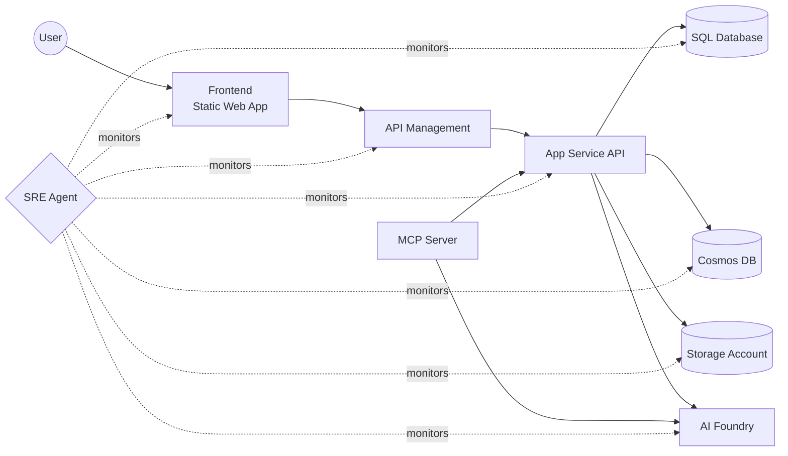
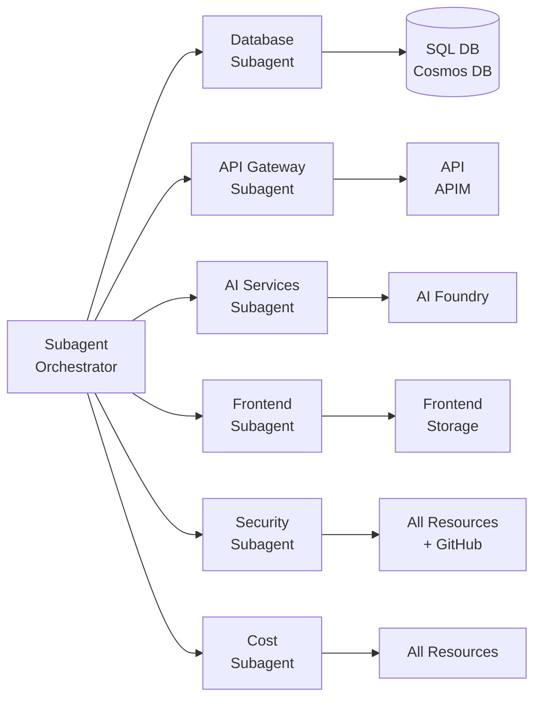

# SRE Agent: sre-poc-ai-my

Azure SRE Agent deployed to East US 2 via GitHub Actions. Provides automated monitoring, incident response, and operational intelligence across the Sales POC Azure infrastructure.

## Architecture Diagram

```mermaid
graph TB
    subgraph SRE["SRE Agent (sre-poc-ai-my)"]
        Agent[SRE Agent Core]
        Sched[Task Scheduler]
        IM[Incident Manager]

        subgraph Subagents
            DB_SA[Database Subagent]
            API_SA[API Gateway Subagent]
            AI_SA[AI Services Subagent]
            FE_SA[Frontend Subagent]
            SEC_SA[Security Subagent]
            COST_SA[Cost Subagent]
        end

        KB[Knowledge Base]
        GH[GitHub Connector]
        MON[Azure Monitor Client]
    end

    subgraph Azure["Monitored Azure Resources"]
        SQL[(SQL Database)]
        COSMOS[(Cosmos DB)]
        STORAGE[(Storage Account)]
        API[App Service API]
        APIM[API Management]
        FOUNDRY[AI Foundry]
        SWA[Static Web App]
    end

    subgraph GitHub["GitHub Repos"]
        UI_R[SalesPOC.UI]
        API_R[SalesPOC.API]
        MCP_R[SalesPOC.MCP]
        APIM_R[SalesPOC.APIM]
        APIC_R[SalesPOC.APIC]
        DB_R[SalesPOC.DB]
        AI_R[SalesPOC.AI]
    end

    Agent --> Sched
    Agent --> IM
    Agent --> MON
    Agent --> GH

    DB_SA --> SQL
    DB_SA --> COSMOS
    API_SA --> API
    API_SA --> APIM
    AI_SA --> FOUNDRY
    FE_SA --> SWA
    FE_SA --> STORAGE

    MON --> SQL
    MON --> COSMOS
    MON --> STORAGE
    MON --> API
    MON --> APIM
    MON --> FOUNDRY
    MON --> SWA

    GH --> UI_R
    GH --> API_R
    GH --> MCP_R
    GH --> APIM_R
    GH --> APIC_R
    GH --> DB_R
    GH --> AI_R
```



## Data Flow Diagram



## Resource Details

| Property | Value |
|---|---|
| **Name** | `sre-poc-ai-my` |
| **Subscription** | ME-MngEnvMCAP829495-myaacoub-1 (`86b37969-9445-49cf-b03f-d8866235171c`) |
| **Resource Group** | `ai-myaacoub` |
| **Region** | East US 2 |
| **Agent Endpoint** | `https://sre-poc-ai-my--618da5b9.daa74423.eastus2.azuresre.ai` |
| **Managed Identity** | `sre-poc-ai-my-bvrrtvop7umme` |
| **App Insights** | `sre-poc-ai-my-b8bc7f81-ab86-app-insights` |

## Monitored Azure Resources

| Resource | Type | Azure Name | Key Purpose |
|---|---|---|---|
| **SQL Database** | Azure SQL | `salespoc-sql / salespoc-db` | Transactional sales data |
| **Cosmos DB** | Azure Cosmos DB | `salespoc-cosmos` | Product catalog, sessions, events |
| **Storage Account** | Azure Storage | `salespocstore` | Documents, exports, media |
| **API** | App Service | `salespoc-api` | Backend REST API |
| **APIM** | API Management | `salespoc-apim` | Gateway, rate limiting, auth |
| **AI Foundry** | Cognitive Services | `salespoc-ai-foundry` | GPT models, embeddings |
| **Frontend** | Static Web App | `salespoc-ui` | React/Next.js UI |

## Connected GitHub Repositories

| Repository | Component | URL |
|---|---|---|
| SalesPOC.UI | Frontend | https://github.com/csdmichael/SalesPOC.UI |
| SalesPOC.API | API | https://github.com/csdmichael/SalesPOC.API |
| SalesPOC.MCP | MCP | https://github.com/csdmichael/SalesPOC.MCP |
| SalesPOC.APIM | APIM | https://github.com/csdmichael/SalesPOC.APIM |
| SalesPOC.APIC | APIC | https://github.com/csdmichael/SalesPOC.APIC |
| SalesPOC.DB | Database | https://github.com/csdmichael/SalesPOC.DB |
| SalesPOC.AI | AI | https://github.com/csdmichael/SalesPOC.AI |

## Metrics Monitored

### SQL Database
| Metric | Unit | Warning | Critical |
|---|---|---|---|
| DTU Consumption | % | 70% | 90% |
| CPU Usage | % | 70% | 90% |
| Storage Usage | % | 75% | 90% |
| Failed Connections | count | 5 | 20 |
| Deadlocks | count | 1 | 5 |
| Active Sessions | % | 70% | 90% |
| Active Workers | % | 70% | 90% |

### Cosmos DB
| Metric | Unit | Warning | Critical |
|---|---|---|---|
| RU Consumption | RU/s | 800 | 950 |
| Throttled Requests (429) | count | 10 | 50 |
| Replication Latency | ms | 100 | 500 |
| Normalized RU % | % | 70% | 90% |

### Storage Account
| Metric | Unit | Warning | Critical |
|---|---|---|---|
| Availability | % | < 99.5% | < 99.0% |
| E2E Latency | ms | 100 | 500 |
| Server Latency | ms | 50 | 200 |

### API (App Service)
| Metric | Unit | Warning | Critical |
|---|---|---|---|
| Response Time | seconds | 1.0 | 3.0 |
| Server Errors (5xx) | count | 5 | 20 |
| Client Errors (4xx) | count | 50 | 200 |
| CPU % | % | 70% | 90% |
| Memory % | % | 75% | 90% |
| Health Check | % | < 90% | < 50% |

### API Management
| Metric | Unit | Warning | Critical |
|---|---|---|---|
| Failed Requests | count | 10 | 50 |
| Backend Duration | ms | 1000 | 5000 |
| Gateway Capacity | % | 70% | 90% |
| Unauthorized (401) | count | 20 | 100 |

### AI Foundry
| Metric | Unit | Warning | Critical |
|---|---|---|---|
| Total Errors | count | 5 | 20 |
| Latency | ms | 2000 | 5000 |
| Success Rate | % | < 95% | < 90% |

### Frontend (Static Web App)
| Metric | Unit | Warning | Critical |
|---|---|---|---|
| Function Errors | count | 5 | 20 |

## SLA Targets

| Resource | Availability | Latency Target |
|---|---|---|
| SQL Database | 99.99% | 100ms |
| Cosmos DB | 99.999% | 10ms |
| Storage | 99.9% | 60ms |
| API | 99.95% | 500ms |
| APIM | 99.95% | 1000ms |
| AI Foundry | 99.9% | 3000ms |
| Frontend | 99.95% | 200ms |

## Subagents



| Subagent | Monitors | Responsibilities |
|---|---|---|
| **Database** | SQL DB, Cosmos DB | DTU/RU analysis, deadlock detection, throttling alerts, storage warnings |
| **API Gateway** | API, APIM | Error rate tracking, response time analysis, capacity monitoring, auth anomalies |
| **AI Services** | AI Foundry | Model error rates, latency tracking, token usage monitoring |
| **Frontend** | Static Web App, Storage | Function errors, availability, latency analysis |
| **Security** | All resources + GitHub | Unauthorized access spikes, connection abuse, scanning detection, repo access |
| **Cost** | All resources | Under-utilization detection, right-sizing recommendations |

## Scheduled Tasks

| Task | Frequency | Description |
|---|---|---|
| `health_check_all` | Every 5 min | Full health check of all Azure resources |
| `subagent_analysis` | Every 15 min | Run all subagent analyses |
| `security_scan` | Every 15 min | Security-focused analysis across all resources |
| `github_repo_check` | Every hour | Check GitHub repository connectivity and status |
| `cost_analysis` | Every 6 hours | Cost optimization and right-sizing analysis |
| `daily_report` | Daily | Comprehensive SRE summary report |

## Incident Response Plans

### SQL Database (4 plans)
| Plan | Trigger | Severity | Auto-Remediate |
|---|---|---|---|
| `sql_high_dtu` | DTU > 90% | SEV2 | Yes (scale up) |
| `sql_connection_failures` | Failed connections > 20/5min | SEV1 | No |
| `sql_deadlocks` | Deadlocks > 5/5min | SEV2 | No |
| `sql_storage_critical` | Storage > 90% | SEV2 | No |

### Cosmos DB (2 plans)
| Plan | Trigger | Severity | Auto-Remediate |
|---|---|---|---|
| `cosmos_throttling` | HTTP 429 > 50/5min | SEV2 | Yes (scale RUs) |
| `cosmos_replication_lag` | Replication > 500ms | SEV2 | No |

### API (3 plans)
| Plan | Trigger | Severity | Auto-Remediate |
|---|---|---|---|
| `api_5xx_spike` | 5xx > 20/5min | SEV1 | Yes (restart) |
| `api_high_response_time` | Response > 3s | SEV2 | No |
| `api_resource_exhaustion` | CPU/Memory > 90% | SEV2 | Yes (scale out) |

### APIM (3 plans)
| Plan | Trigger | Severity | Auto-Remediate |
|---|---|---|---|
| `apim_capacity_high` | Capacity > 90% | SEV2 | No |
| `apim_backend_slow` | Backend > 5000ms | SEV2 | No |
| `apim_auth_spike` | Unauthorized > 100/5min | SEV2 | No |

### AI Foundry (2 plans)
| Plan | Trigger | Severity | Auto-Remediate |
|---|---|---|---|
| `foundry_high_error_rate` | Errors > 20/5min | SEV2 | No |
| `foundry_high_latency` | Latency > 5000ms | SEV3 | No |

### Storage (2 plans)
| Plan | Trigger | Severity | Auto-Remediate |
|---|---|---|---|
| `storage_availability_drop` | Availability < 99% | SEV1 | No |
| `storage_high_latency` | E2E Latency > 500ms | SEV3 | No |

### Frontend (1 plan)
| Plan | Trigger | Severity | Auto-Remediate |
|---|---|---|---|
| `frontend_function_errors` | Function errors > 20/5min | SEV2 | No |

## Project Structure

```
├── .github/workflows/deploy.yml   # CI/CD pipeline
├── infra/
│   ├── main.bicep                 # Infrastructure as Code
│   └── main.bicepparam            # Bicep parameters
├── src/
│   ├── __init__.py
│   ├── agent.py                   # SRE agent core + task registration
│   ├── config.py                  # Configuration / settings
│   ├── github_connector.py        # GitHub repo monitoring
│   ├── incidents.py               # Incident plans + manager
│   ├── knowledge_base.py          # Architecture, troubleshooting, procedures
│   ├── main.py                    # Entry point
│   ├── metrics.py                 # Metric definitions + SLA targets
│   ├── monitors.py                # Azure Monitor resource queries
│   ├── scheduler.py               # Async scheduled task runner
│   └── subagents.py               # Specialized analysis subagents
├── Dockerfile
├── requirements.txt
└── .env.example
```

## GitHub Actions Setup

The workflow requires these **repository secrets**:

| Secret | Description |
|---|---|
| `AZURE_CLIENT_ID` | Service principal / federated credential client ID |
| `AZURE_TENANT_ID` | Azure AD tenant ID |
| `APP_INSIGHTS_CONNECTION_STRING` | Application Insights connection string |

### Configure OIDC for GitHub Actions

1. Create an Azure AD app registration or use an existing service principal.
2. Add a federated credential for your GitHub repository (`repo:csdmichael/SalesPOC.SRE:ref:refs/heads/main`).
3. Grant the service principal **Contributor** role on resource group `ai-myaacoub`.
4. Set the three secrets above in your GitHub repository settings.

## Local Development

```bash
# Create virtual environment
python -m venv .venv
.venv\Scripts\activate      # Windows
source .venv/bin/activate   # Linux/macOS

# Install dependencies
pip install -r requirements.txt

# Copy and configure environment
cp .env.example .env
# Edit .env with your values

# Run agent
python -m src.main
```

## Deployment

Pushing to `main` triggers the GitHub Actions workflow which:

1. **Build** – Lints code, builds Docker image, pushes to GHCR.
2. **Deploy** – Logs into Azure via OIDC, deploys Bicep template to `ai-myaacoub` resource group.
