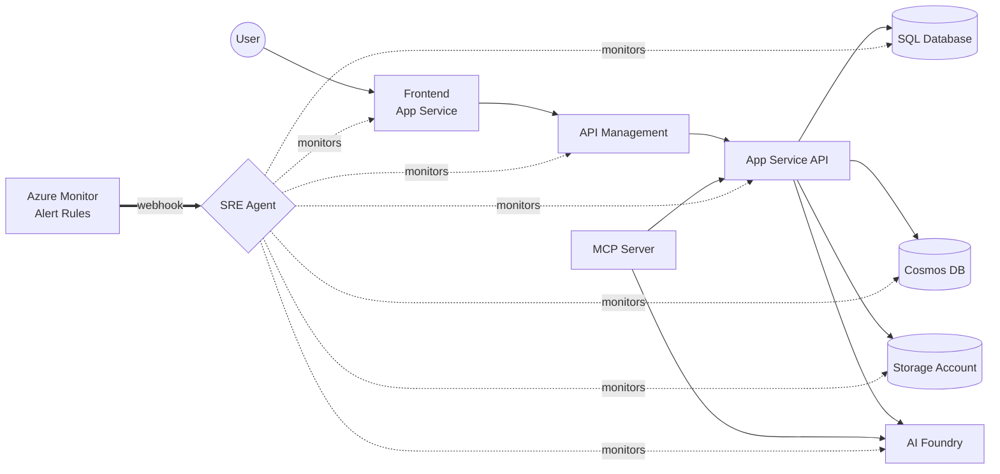
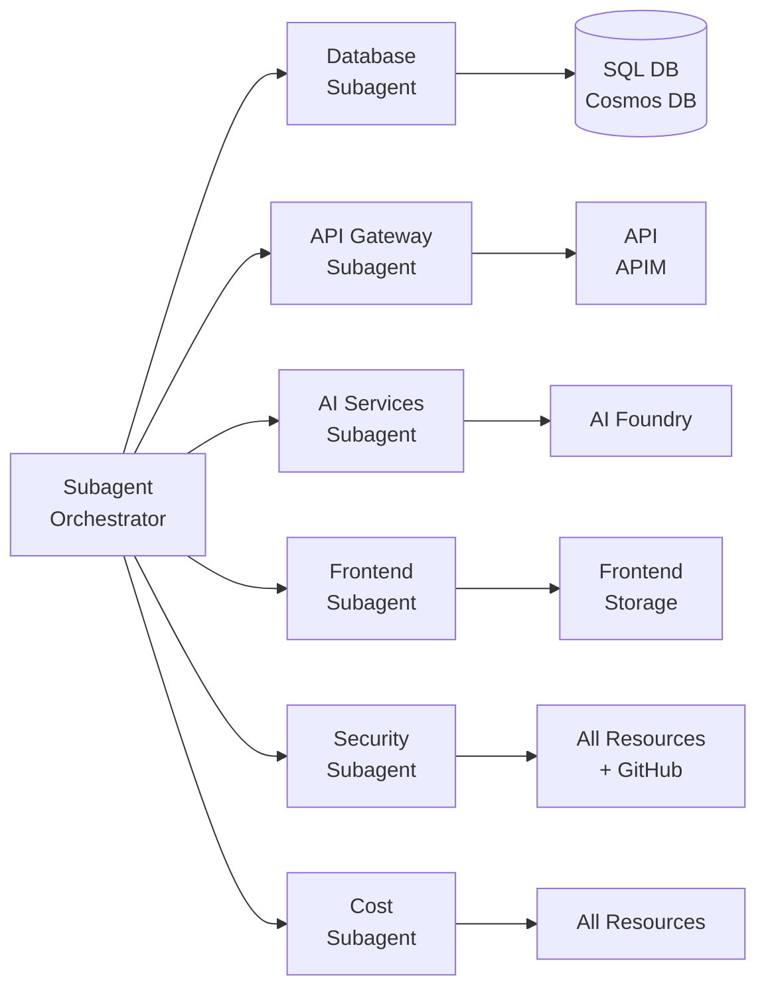
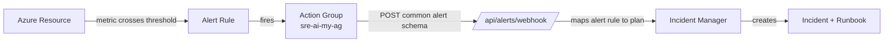

```mermaid
graph TB
    subgraph SRE["SRE Agent (sre-ai-my)"]
        Agent[SRE Agent Core]
        WH[Webhook Server :8080]
        LZ[/healthz liveness probe/]
        Sched[Task Scheduler]
        IM[Incident Manager]

        subgraph Subagents
            DB_SA[Database Subagent]
            API_SA[API Gateway Subagent]
            AI_SA[AI Services Subagent]
            FE_SA[Frontend Subagent]
            SEC_SA[Security Subagent]
            COST_SA[Cost Subagent]
        end

        KB[Knowledge Base]
        GH[GitHub Connector]
        MON[Azure Monitor Client]
    end

    subgraph AzMon["Azure Monitor"]
        AG[Action Group<br/>sre-ai-my-ag]
        AR[18 Metric Alert Rules]
    end

    subgraph Azure["Monitored Azure Resources"]
        SQL[(SQL Database)]
        COSMOS[(Cosmos DB)]
        STORAGE[(Storage Account)]
        API[App Service API]
        APIM[API Management]
        FOUNDRY[AI Foundry]
        FE[Frontend App Service]
    end

    subgraph GitHub["GitHub Repos"]
        UI_R[SalesPOC.UI]
        API_R[SalesPOC.API]
        MCP_R[SalesPOC.MCP]
        APIM_R[SalesPOC.APIM]
        APIC_R[SalesPOC.APIC]
        DB_R[SalesPOC.DB]
        AI_R[SalesPOC.AI]
    end

    Agent --> Sched
    Agent --> IM
    Agent --> MON
    Agent --> GH

    AR -.evaluates.-> SQL
    AR -.evaluates.-> COSMOS
    AR -.evaluates.-> STORAGE
    AR -.evaluates.-> API
    AR -.evaluates.-> APIM
    AR -.evaluates.-> FOUNDRY
    AR -.evaluates.-> FE
    AR --fires--> AG
    AG --webhook POST--> WH
    WH --> IM

    DB_SA --> SQL
    DB_SA --> COSMOS
    API_SA --> API
    API_SA --> APIM
    AI_SA --> FOUNDRY
    FE_SA --> FE
    FE_SA --> STORAGE

    MON --> SQL
    MON --> COSMOS
    MON --> STORAGE
    MON --> API
    MON --> APIM
    MON --> FOUNDRY
    MON --> FE

    GH --> UI_R
    GH --> API_R
    GH --> MCP_R
    GH --> APIM_R
    GH --> APIC_R
    GH --> DB_R
    GH --> AI_R
```

# SRE Agent: sre-ai-my

Azure SRE Agent deployed to East US 2 via GitHub Actions. Provides automated monitoring, incident response, and operational intelligence across the Sales POC Azure infrastructure.

All Azure Monitor SDK calls run in a thread pool (`asyncio.to_thread`) to avoid blocking the async event loop, ensuring the HTTP server, scheduler, and webhook processing remain responsive at all times.

## Architecture Diagram



## Data Flow Diagram



## Resource Details

| Property | Value |
|---|---|
| **Name** | `sre-ai-my` |
| **Subscription** | ME-MngEnvMCAP829495-myaacoub-1 (`86b37969-9445-49cf-b03f-d8866235171c`) |
| **Resource Group** | `ai-myaacoub` |
| **Region** | East US 2 |
| **Agent Endpoint** | `https://sre-ai-my--0cad75dc.4650bed8.eastus2.azuresre.ai` |
| **Managed Identity** | `sre-ai-my-bvrrtvop7umme` |
| **App Insights** | `sre-ai-my-b8bc7f81-ab86-app-insights` |

## Monitored Azure Resources

| Resource | Type | Azure Name | Key Purpose |
|---|---|---|---|
| **SQL Database** | Azure SQL | `ai-db-poc / ai-db-poc` | Transactional sales data |
| **Cosmos DB** | Azure Cosmos DB | `cosmos-ai-poc` | Product catalog, sessions, events |
| **Storage Account** | Azure Storage | `aistoragemyaacoub` | Documents, exports, media |
| **API** | App Service | `SalesPOC-API` | Backend REST API |
| **APIM** | API Management | `apim-poc-my` | Gateway, rate limiting, auth |
| **AI Foundry** | Cognitive Services | `001-ai-poc` | GPT models, embeddings |
| **Frontend** | App Service | `SalesPOC` | React/Next.js UI |

## Connected GitHub Repositories

| Repository | Component | URL |
|---|---|---|
| SalesPOC.UI | Frontend | https://github.com/csdmichael/SalesPOC.UI |
| SalesPOC.API | API | https://github.com/csdmichael/SalesPOC.API |
| SalesPOC.MCP | MCP | https://github.com/csdmichael/SalesPOC.MCP |
| SalesPOC.APIM | APIM | https://github.com/csdmichael/SalesPOC.APIM |
| SalesPOC.APIC | APIC | https://github.com/csdmichael/SalesPOC.APIC |
| SalesPOC.DB | Database | https://github.com/csdmichael/SalesPOC.DB |
| SalesPOC.AI | AI | https://github.com/csdmichael/SalesPOC.AI |

## Metrics Monitored

### SQL Database
| Metric | Unit | Warning | Critical |
|---|---|---|---|
| CPU Usage | % | 70% | 90% |
| Storage Usage | % | 75% | 90% |
| Failed Connections | count | 5 | 20 |
| Deadlocks | count | 1 | 5 |
| Active Workers | % | 70% | 90% |

### Cosmos DB
| Metric | Unit | Warning | Critical |
|---|---|---|---|
| RU Consumption | RU/s | 800 | 950 |
| Throttled Requests (429) | count | 10 | 50 |
| Replication Latency | ms | 100 | 500 |
| Normalized RU % | % | 70% | 90% |

### Storage Account
| Metric | Unit | Warning | Critical |
|---|---|---|---|
| Availability | % | < 99.5% | < 99.0% |
| E2E Latency | ms | 100 | 500 |
| Server Latency | ms | 50 | 200 |

### API (App Service)
| Metric | Unit | Warning | Critical |
|---|---|---|---|
| Response Time | seconds | 1.0 | 3.0 |
| Server Errors (5xx) | count | 5 | 20 |
| Client Errors (4xx) | count | 50 | 200 |
| Avg Memory Working Set | bytes | — | — |
| Avg Response Time | seconds | 1.0 | 3.0 |

### API Management
| Metric | Unit | Warning | Critical |
|---|---|---|---|
| Failed Requests | count | 10 | 50 |
| Backend Duration | ms | 1000 | 5000 |
| Gateway Capacity | % | 70% | 90% |
| Unauthorized (401) | count | 20 | 100 |

### AI Foundry
| Metric | Unit | Warning | Critical |
|---|---|---|---|
| Total Errors | count | 5 | 20 |
| Latency | ms | 2000 | 5000 |
| Success Rate | % | < 95% | < 90% |

### Frontend (App Service)
| Metric | Unit | Warning | Critical |
|---|---|---|---|
| Response Time | seconds | 1.0 | 3.0 |
| Server Errors (5xx) | count | 5 | 20 |
| Avg Memory Working Set | bytes | — | — |
| Avg Response Time | seconds | 1.0 | 3.0 |

## SLA Targets

| Resource | Availability | Latency Target |
|---|---|---|
| SQL Database | 99.99% | 100ms |
| Cosmos DB | 99.999% | 10ms |
| Storage | 99.9% | 60ms |
| API | 99.95% | 500ms |
| APIM | 99.95% | 1000ms |
| AI Foundry | 99.9% | 3000ms |
| Frontend | 99.95% | 200ms |

## Subagents



| Subagent | Monitors | Responsibilities |
|---|---|---|
| **Database** | SQL DB, Cosmos DB | CPU/RU analysis, deadlock detection, throttling alerts, storage warnings |
| **API Gateway** | API, APIM | Error rate tracking, response time analysis, capacity monitoring, auth anomalies |
| **AI Services** | AI Foundry | Model error rates, latency tracking, token usage monitoring |
| **Frontend** | App Service, Storage | HTTP errors, availability, latency analysis |
| **Security** | All resources + GitHub | Unauthorized access spikes, connection abuse, scanning detection, repo access |
| **Cost** | All resources | Under-utilization detection, right-sizing recommendations |

## Scheduled Tasks

| Task | Frequency | Description |
|---|---|---|
| `health_check_all` | Every 5 min | Full health check of all Azure resources |
| `subagent_analysis` | Every 15 min | Run all subagent analyses |
| `security_scan` | Every 15 min | Security-focused analysis across all resources |
| `github_repo_check` | Every hour | Check GitHub repository connectivity and status |
| `cost_analysis` | Every 6 hours | Cost optimization and right-sizing analysis |
| `daily_report` | Daily | Comprehensive SRE summary report |

## Azure Monitor Integration

The incident platform is connected to Azure Monitor via metric alert rules and an action group that delivers webhook notifications to the SRE agent.

### Alert Flow



### Action Group

| Property | Value |
|---|---|
| **Name** | `sre-ai-my-ag` |
| **Type** | Webhook |
| **Target** | `https://<container-app-fqdn>/api/alerts/webhook` |
| **Schema** | Common Alert Schema |

### Alert Rules (18 total)

| Alert Rule | Resource | Metric | Condition | Severity | Incident Plan |
|---|---|---|---|---|---|
| `sre-sql-high-cpu` | SQL DB | CPU % | > 90% | SEV2 | `sql_high_cpu` |
| `sre-sql-connection-failures` | SQL DB | Failed connections | > 20 | SEV1 | `sql_connection_failures` |
| `sre-sql-deadlocks` | SQL DB | Deadlocks | > 5 | SEV2 | `sql_deadlocks` |
| `sre-sql-storage-critical` | SQL DB | Storage % | > 90% | SEV2 | `sql_storage_critical` |
| `sre-cosmos-throttling` | Cosmos DB | Normalized RU % | > 90% | SEV2 | `cosmos_throttling` |
| `sre-cosmos-replication-lag` | Cosmos DB | Replication latency | > 500ms | SEV2 | `cosmos_replication_lag` |
| `sre-storage-availability-drop` | Storage | Availability | < 99% | SEV1 | `storage_availability_drop` |
| `sre-storage-high-latency` | Storage | E2E Latency | > 500ms | SEV3 | `storage_high_latency` |
| `sre-api-5xx-spike` | API | Http5xx | > 20 | SEV1 | `api_5xx_spike` |
| `sre-api-high-response-time` | API | Response time | > 3s | SEV2 | `api_high_response_time` |
| `sre-api-cpu-exhaustion` | App Service Plan | CPU % | > 90% | SEV2 | `api_resource_exhaustion` |
| `sre-api-memory-exhaustion` | App Service Plan | Memory % | > 90% | SEV2 | `api_resource_exhaustion` |
| `sre-apim-capacity-high` | APIM | Capacity | > 90% | SEV2 | `apim_capacity_high` |
| `sre-apim-backend-slow` | APIM | Backend duration | > 5000ms | SEV2 | `apim_backend_slow` |
| `sre-apim-auth-spike` | APIM | Unauthorized | > 100 | SEV2 | `apim_auth_spike` |
| `sre-foundry-high-error-rate` | AI Foundry | Total errors | > 20 | SEV2 | `foundry_high_error_rate` |
| `sre-foundry-high-latency` | AI Foundry | Latency | > 5000ms | SEV3 | `foundry_high_latency` |
| `sre-frontend-http-errors` | Frontend | Http5xx | > 20 | SEV2 | `frontend_http_errors` |

All alert rules evaluate every 5 minutes with a 5-minute window.

### HTTP Endpoints

| Method | Path | Description |
|---|---|---|
| `POST` | `/api/alerts/webhook` | Azure Monitor common alert schema webhook receiver |
| `GET` | `/api/health` | Full agent health check (resources, repos, incidents, scheduler) |
| `GET` | `/healthz` | Lightweight liveness probe (no Azure calls, instant response) |
| `GET` | `/api/dashboard` | Azure Monitor metrics dashboard summary |
| `GET` | `/api/incidents` | Active incidents list |

### Container Health Probes

The Container App is configured with HTTP health probes targeting `/healthz`:

| Probe | Path | Period | Failure Threshold | Initial Delay |
|---|---|---|---|---|
| **Startup** | `/healthz` | 3s | 10 | 2s |
| **Liveness** | `/healthz` | 30s | 3 | — |

The `/healthz` endpoint returns immediately without making any Azure SDK calls, ensuring probes never time out even during heavy metric queries.

### SRE Agent Connectors

The `Microsoft.App/agents` resource requires data connectors to integrate with external systems. These are provisioned automatically by the `deploy-agent` workflow job.

| Connector | Type | Identity | Purpose |
|---|---|---|---|
| `azuremonitor` | AzureMonitor | User-assigned MI | Metric & alert data from Azure Monitor |
| `azureresourcegraph` | AzureResourceGraph | User-assigned MI | Resource discovery & topology |
| `github` | GitHub | — | Repository access for code-aware incident response |

Incident response plans, scheduled tasks, and GitHub repos are provisioned via the agent's own REST API (separate from the ARM API) using [infra/provision-agent-api.sh](infra/provision-agent-api.sh).

> **Note:** The Azure SRE Agent API only accepts **user-delegated tokens** (interactive login). Service principal / OIDC tokens are rejected because the `Azure SRE Agent` app registration (`59f0a04a-b322-4310-adc9-39ac41e9631e`) has no app roles — only a delegated scope (`Threads.ReadWrite.All`). This means `provision-agent-api.sh` **cannot** run in CI/CD and must be run manually:
>
> ```bash
> az login
> bash infra/provision-agent-api.sh https://sre-ai-my--0cad75dc.4650bed8.eastus2.azuresre.ai
> ```
>
> The script is idempotent — safe to re-run at any time. Run it once during initial setup and whenever task/trigger definitions change.

### Agent REST API

The SRE Agent exposes its own REST API at the agent endpoint, separate from the ARM management API. Authentication uses a Bearer token scoped to `https://azuresre.ai`:

```bash
TOKEN=$(az account get-access-token --resource "https://azuresre.ai" --query "accessToken" -o tsv)
```

| Method | Path | Description |
|---|---|---|
| `GET/POST` | `/api/v1/scheduledtasks` | List / create scheduled tasks |
| `PUT/DELETE` | `/api/v1/scheduledtasks/{id}` | Update / delete a task |
| `POST` | `/api/v1/scheduledtasks/{id}/pause\|resume\|execute` | Task lifecycle |
| `GET` | `/api/v1/httptriggers` | List incident response plans (HTTP triggers) |
| `POST` | `/api/v1/httptriggers/create` | Create incident response plan |
| `POST` | `/api/v1/httptriggers/{id}/enable\|disable\|execute` | Trigger lifecycle |
| `GET` | `/api/v1/github/repos` | List connected GitHub repos |
| `GET` | `/api/v1/github/config` | GitHub OAuth configuration |
| `POST` | `/api/v1/github/auth/pat` | Set GitHub PAT (form-urlencoded) |
| `GET` | `/api/v1/feature/details` | Agent feature flags and settings |

### Agent Extensions (ARM API — Internal Tenants Only)

The ARM API (`Microsoft.App/agents`, `2025-05-01-preview`) has additional sub-resource endpoints (`subagents`, `skills`, `scheduledTasks`) that are restricted to internal Microsoft tenants. These return `Agent Extensions are not available for this tenant`.

Scheduled tasks and incident response plans are instead provisioned via the **agent's own REST API** (see above). Subagents run as application-level code in [src/subagents.py](src/subagents.py).

### GitHub Connector Authentication

The GitHub connector requires OAuth or PAT authorization for the agent to access repositories:

- **OAuth**: Visit the URL from `GET /api/v1/github/config` to authorize
- **PAT**: `POST /api/v1/github/auth/pat` with form-urlencoded `pat=<token>` (requires `repo` scope)

### IAM Roles

Access to use this agent requires an Azure RBAC **SRE Agent Reader** role or higher on the agent resource.

| Role | Scope | Purpose |
|---|---|---|
| **SRE Agent Reader** (or higher) | `sre-ai-my` agent resource | Required for users to access and interact with the SRE agent |
| **Monitoring Reader** | Resource group `ai-myaacoub` | Assigned to managed identity (`sre-ai-my-identity`) to query Azure Monitor metrics |

## Incident Response Plans

### SQL Database (4 plans)
| Plan | Trigger | Severity | Auto-Remediate |
|---|---|---|---|
| `sql_high_cpu` | CPU > 90% | SEV2 | Yes (scale up) |
| `sql_connection_failures` | Failed connections > 20/5min | SEV1 | No |
| `sql_deadlocks` | Deadlocks > 5/5min | SEV2 | No |
| `sql_storage_critical` | Storage > 90% | SEV2 | No |

### Cosmos DB (2 plans)
| Plan | Trigger | Severity | Auto-Remediate |
|---|---|---|---|
| `cosmos_throttling` | HTTP 429 > 50/5min | SEV2 | Yes (scale RUs) |
| `cosmos_replication_lag` | Replication > 500ms | SEV2 | No |

### API (3 plans)
| Plan | Trigger | Severity | Auto-Remediate |
|---|---|---|---|
| `api_5xx_spike` | 5xx > 20/5min | SEV1 | Yes (restart) |
| `api_high_response_time` | Response > 3s | SEV2 | No |
| `api_resource_exhaustion` | CPU/Memory > 90% | SEV2 | Yes (scale out) |

### APIM (3 plans)
| Plan | Trigger | Severity | Auto-Remediate |
|---|---|---|---|
| `apim_capacity_high` | Capacity > 90% | SEV2 | No |
| `apim_backend_slow` | Backend > 5000ms | SEV2 | No |
| `apim_auth_spike` | Unauthorized > 100/5min | SEV2 | No |

### AI Foundry (2 plans)
| Plan | Trigger | Severity | Auto-Remediate |
|---|---|---|---|
| `foundry_high_error_rate` | Errors > 20/5min | SEV2 | No |
| `foundry_high_latency` | Latency > 5000ms | SEV3 | No |

### Storage (2 plans)
| Plan | Trigger | Severity | Auto-Remediate |
|---|---|---|---|
| `storage_availability_drop` | Availability < 99% | SEV1 | No |
| `storage_high_latency` | E2E Latency > 500ms | SEV3 | No |

### Frontend (1 plan)
| Plan | Trigger | Severity | Auto-Remediate |
|---|---|---|---|
| `frontend_http_errors` | Http5xx > 20/5min | SEV2 | No |

## Project Structure

```
├── .github/workflows/deploy.yml   # CI/CD pipeline (build → deploy-agent → deploy-monitoring)
├── infra/
│   ├── main.bicep                 # Container App, Log Analytics, Identity, RBAC
│   ├── main.bicepparam            # Bicep parameters
│   ├── alerts.bicep               # Azure Monitor alert rules + action group (parameterized)
│   └── provision-agent-api.sh     # Provisions scheduled tasks, incident plans & repos via agent API (manual)
├── src/
│   ├── __init__.py
│   ├── agent.py                   # SRE agent core + webhook processing
│   ├── config.py                  # Centralized configuration (all resource names & settings)
│   ├── github_connector.py        # GitHub repo monitoring
│   ├── incidents.py               # Incident plans + manager
│   ├── knowledge_base.py          # Architecture, troubleshooting, procedures
│   ├── main.py                    # Entry point + HTTP server startup
│   ├── metrics.py                 # Metric definitions + SLA targets
│   ├── monitors.py                # Azure Monitor resource queries (async via thread pool)
│   ├── scheduler.py               # Async scheduled task runner
│   ├── server.py                  # aiohttp webhook + health + liveness endpoints
│   └── subagents.py               # Specialized analysis subagents
├── Dockerfile
├── requirements.txt
└── .env.example
```

## GitHub Actions Setup

The workflow requires these **repository secrets**:

| Secret | Description |
|---|---|
| `AZURE_CLIENT_ID` | Service principal / federated credential client ID |
| `AZURE_TENANT_ID` | Azure AD tenant ID |
| `APP_INSIGHTS_CONNECTION_STRING` | Application Insights connection string |

### Configure OIDC for GitHub Actions

1. Create an Azure AD app registration or use an existing service principal.
2. Add a federated credential for your GitHub repository (`repo:csdmichael/SalesPOC.SRE:ref:refs/heads/main`).
3. Grant the service principal **Contributor** role on resource group `ai-myaacoub`.
4. Set the three secrets above in your GitHub repository settings.

## Local Development

```bash
# Create virtual environment
python -m venv .venv
.venv\Scripts\activate      # Windows
source .venv/bin/activate   # Linux/macOS

# Install dependencies
pip install -r requirements.txt

# Copy and configure environment
cp .env.example .env
# Edit .env with your values

# Run agent
python -m src.main
```

## Deployment

Pushing to `main` triggers the GitHub Actions workflow which runs three separate jobs:

1. **Build** (`build`) – Lints code, builds Docker image, pushes to GHCR.
2. **Deploy SRE Agent** (`deploy-agent`) – Logs into Azure via OIDC, deploys `main.bicep` (Container App + startup/liveness probes + Monitoring Reader role). Provisions data connectors (AzureMonitor, AzureResourceGraph, GitHub) on the `Microsoft.App/agents` resource. Outputs the Container App FQDN.
3. **Deploy Monitoring** (`deploy-monitoring`) – Deploys `alerts.bicep` (18 parameterized metric alert rules + action group webhook → Container App FQDN from step 2).

Verbose Azure SDK HTTP logging is suppressed at startup to keep container logs clean and actionable.
